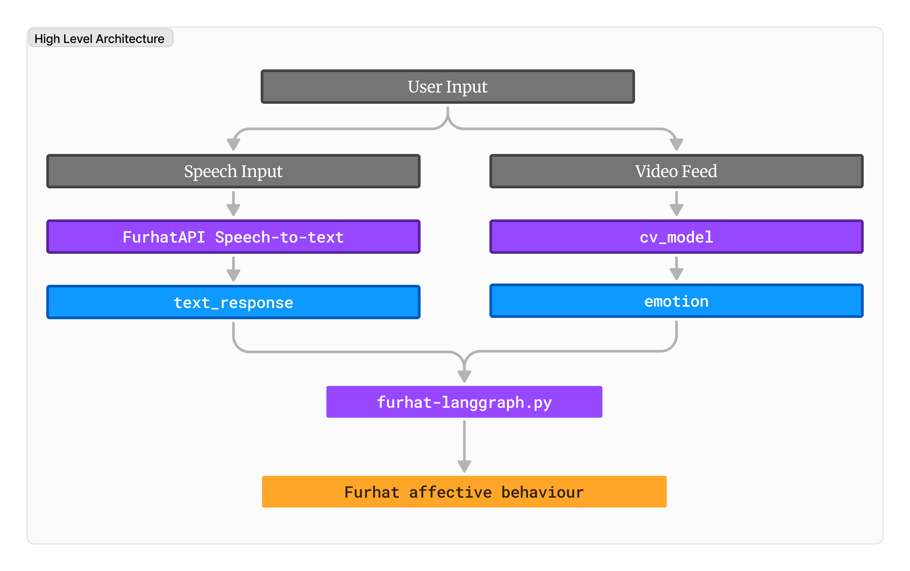
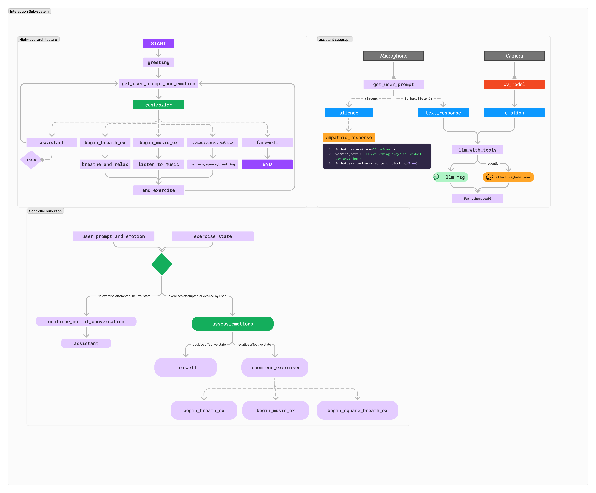
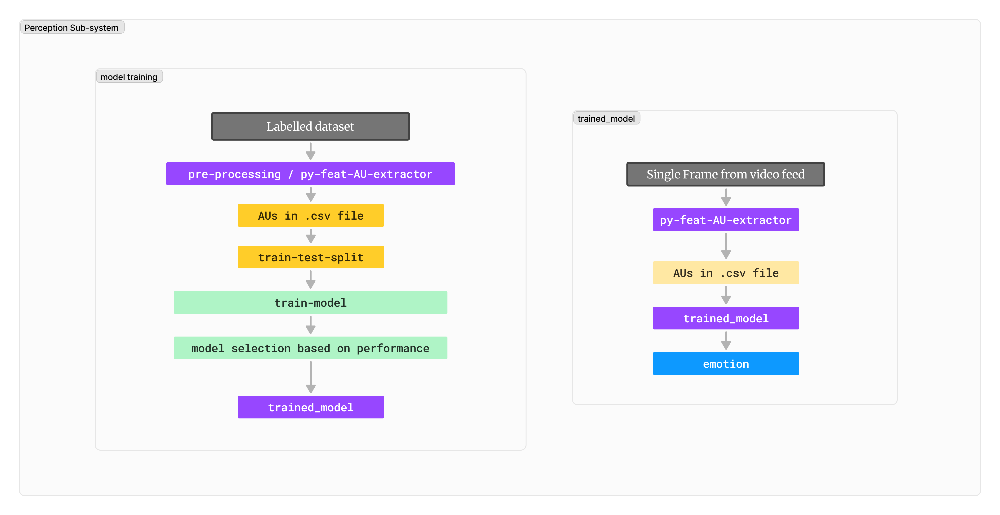

# Senti: A Mindfulness and Emotional Coach

Senti is an innovative system designed to function as a mindfulness coach powered by LangGraph and computer vision. It leverages advanced AI capabilities to analyze human behavior and affective states in real-time, generating socially adaptive behavior using the Furhat virtual robot.

---

## Project Overview

### Objective
To build an interactive system that integrates:
1. **User Perception Sub-system**: Detects user affective states via webcam input and processes them using ML techniques.
2. **Interaction Sub-system**: Uses detected affective states and speech input to generate socially adaptive behavior and therapeutic exercises.

### Scenario
Senti operates as a **mindfulness coach**, engaging in conversations, perceiving emotional states, and recommending exercises to uplift the user's mood.

---

## System Architecture

### High-Level Architecture

### Sub-systems
1. **Interaction Sub-system**  
   Responsible for conversational flow and adaptive behavior.  
   

2. **Perception Sub-system**  
   Responsible for real-time emotion detection using Py-Feat and ML models.  
   

---

## Features

### User Perception Sub-system
- **Input**: Webcam video of a single user.
- **Output**: Real-time affective state (valence, arousal).
- **Technology**: Py-Feat for feature extraction, ML models trained on DiffusionFER dataset.

### Interaction Sub-system
- **Input**: Affective state + user speech.
- **Output**: Conversational responses and therapeutic exercise recommendations.
- **Technology**: LangGraph/LangChain, Furhat API for gestures and behaviors.

---

## Implementation Details

### Perception Sub-system
- **Design**: Extract facial Action Units to model affective states.
- **Implementation**: Integrated Py-Feat for real-time detection and custom ML models trained with extracted features.

### Interaction Sub-system
- **Design**: A LangGraph-powered conversational flow with conditional therapeutic exercises.
- **Implementation**: Designed actions and gestures via Furhat API tools, enabling exercises like breathing techniques or music relaxation.

---

## Results

- **Perception Sub-system**: Achieved high accuracy in detecting emotions and transmitting affective states.
- **Interaction Sub-system**: Smooth conversational flow with effective therapeutic exercises.

---

## Challenges

1. **Multi-user Input**: Difficulties handling multiple users simultaneously.  
   - **Solution**: Added a false background to improve single-user focus.
2. **Tool Calls**: Conversation state inconsistencies during tool-triggered actions.  
   - **Solution**: Enhanced tool descriptions for better decision-making.

---

## Ethical Considerations

Senti's conversational AI includes filters to mitigate inappropriate responses, ensuring a focus on user well-being.

---

## How We Used AI (ChatGPT)
- Accelerated framework learning for Py-Feat, PyTorch, LangGraph, and LangChain.
- Helped in refining project documentation and presentation materials.
- Generated this README file.

---

## Conclusion

Senti demonstrates an effective integration of emotion recognition and conversational AI, paving the way for intelligent and adaptive interactive systems. Challenges like multi-user handling and tool call management provide avenues for future improvement.

---

## References
- [Py-Feat Documentation](https://py-feat.org)
- [Furhat API](https://furhatrobotics.com/developers/)
